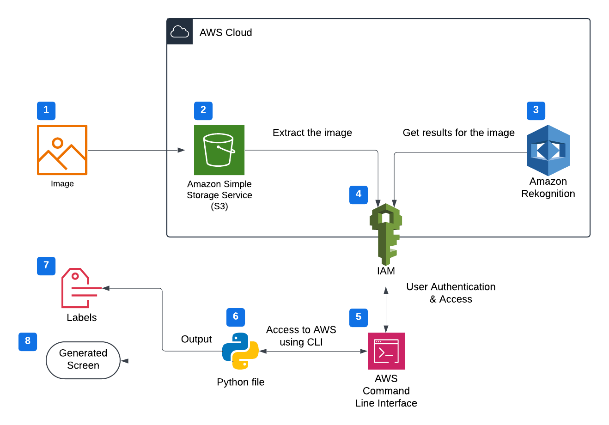
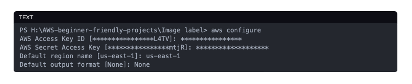
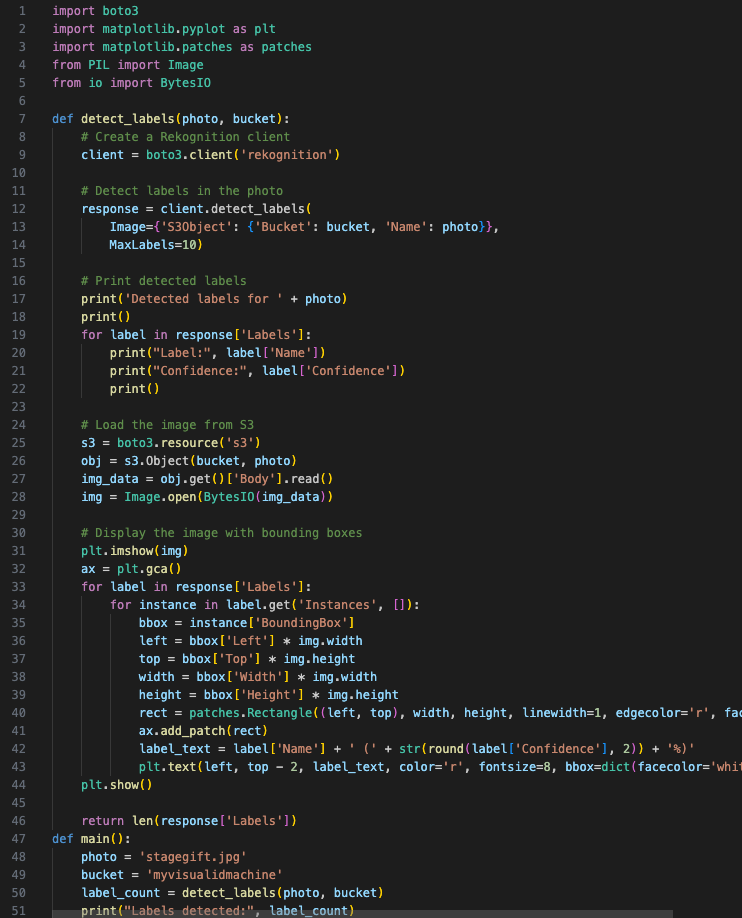
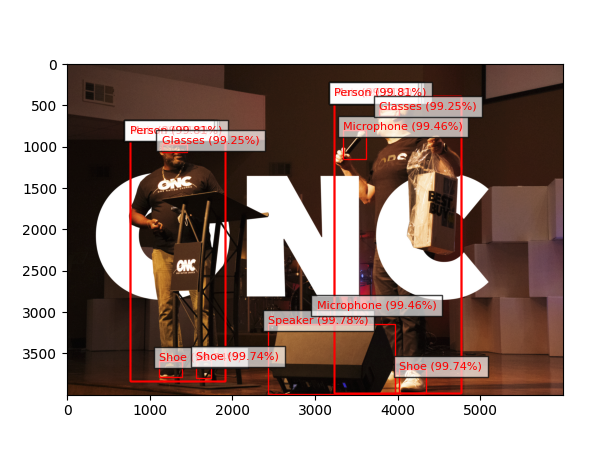

# Image-Labels-Generator
## What is AWS Rekognition, and What is it Used For?
By now, many people are familiar with tools like Apple’s Visual Look Up (AVLU), which allow users to identify specific items in their photos. This feature has received high praise for its usefulness, whether you're trying to learn more about an object or identify unfamiliar items. Now, imagine being able to go a step further: identifying not just one item, but multiple objects in a single image, each with detailed insights. This is the power of Amazon Rekognition.
## Project Sequence
- Creating an Amazon S3 Bucket
- Uploading images to the S3 Bucket
- Installing configuring the AWS Command line interface (CLI)
- Importing libraries
- Adding detect_labels function
- Adding main function
- Running your python file
## Architecture Diagram

## Steps To Build The Image Labels Generator
1. Upload the image to S3: The first step is to upload the image you want labeled into an Amazon S3 bucket using the AWS Management Console.
2. Create an IAM User with Administrator Access:
   - Attach the AdministratorAccess policy to the user to grant full access to AWS services.
   - Before moving on to coding, create an Access Key and Secret Access Key for the user. These keys are essential for remote access to AWS.
   - Using the Access Key and the Secret Access Key, connect to AWS from your local computer via Terminal. The configuration process will look this. (see image below)
     
  

3. Write and Configure the Python Script:
   - Withthe configuration complete, create a Python file using software like Visual Code to write the necessary code and install required libraries.
   - To conduct the task, you'll need the following libraries: boto3, matplotlib, PIL, BytesIO.
   - Create a detect_labels function. This function retrieves the photo from the S3 bucket and uses Amazon Rekognition to detect labels in the image.
   - The code will look like this:
   - 
     
     
4. Run the Script: After running the script, the result will display the labels describing items found in the image you initially uploaded to the S3 bucket.
5. 

